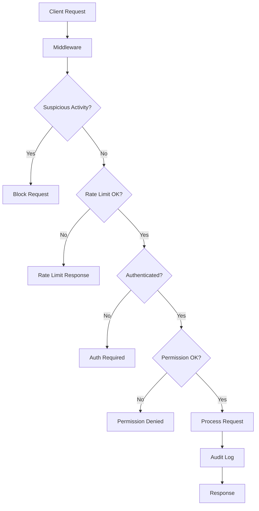

# 🔒 Panduan Keamanan Sinoman SuperApp

Dokumen ini berisi panduan lengkap implementasi keamanan untuk sistem koperasi Sinoman SuperApp.

## 📋 Daftar Isi

1. [Gambaran Umum](#gambaran-umum)
2. [Konfigurasi Keamanan](#konfigurasi-keamanan)
3. [Sistem Audit dan Log](#sistem-audit-dan-log)
4. [Rate Limiting](#rate-limiting)
5. [Sistem Permission](#sistem-permission)
6. [Dashboard Monitoring](#dashboard-monitoring)
7. [Testing Keamanan](#testing-keamanan)
8. [Panduan Deployment](#panduan-deployment)
9. [Incident Response](#incident-response)
10. [Maintenance](#maintenance)

## 🏗️ Gambaran Umum

Sistem keamanan Sinoman SuperApp dirancang khusus untuk melindungi data koperasi dan transaksi keuangan anggota dengan menerapkan prinsip-prinsip keamanan berlapis (defense in depth).

### Fitur Keamanan Utama

- ✅ **Multi-tenant Isolation**: Pemisahan data antar koperasi
- ✅ **Rate Limiting**: Perlindungan dari serangan brute force
- ✅ **Audit Logging**: Pencatatan lengkap aktivitas sistem
- ✅ **Permission System**: Kontrol akses berbasis peran
- ✅ **Real-time Monitoring**: Dashboard monitoring keamanan
- ✅ **Input Validation**: Perlindungan dari SQL injection & XSS
- ✅ **Security Headers**: Perlindungan browser-level
- ✅ **CSRF Protection**: Perlindungan dari serangan CSRF

### Arsitektur Keamanan



## ⚙️ Konfigurasi Keamanan

### Environment Variables

Salin file `.env.example` ke `.env.local` dan isi dengan nilai yang sesuai:

```bash
# Keamanan Dasar
JWT_SECRET=kunci_rahasia_jwt_minimal_32_karakter
SESSION_SECRET=kunci_sesi_rahasia_minimal_32_karakter
CSRF_SECRET=kunci_csrf_rahasia_minimal_32_karakter

# Rate Limiting
RATE_LIMIT_MAX_REQUESTS=100
RATE_LIMIT_WINDOW_MS=60000

# Audit & Monitoring
ENABLE_AUDIT_LOG=true
LOG_LEVEL=info
MONITORING_WEBHOOK_URL=https://webhook.monitoring.anda.com
ALERT_EMAIL=admin@koperasi.anda.com

# Upload Security
MAX_FILE_SIZE=5242880

# Environment
NODE_ENV=production
NEXT_PUBLIC_APP_ENV=production
```

### Konfigurasi Keamanan (config/security.ts)

File konfigurasi utama yang berisi:

- **Rate Limiting**: Batas request per endpoint
- **CORS**: Kebijakan lintas domain
- **CSP**: Content Security Policy
- **Password Policy**: Kebijakan kata sandi
- **File Upload**: Validasi file upload
- **Transaction Limits**: Batas transaksi keuangan

```typescript
// Contoh konfigurasi rate limiting
export const securityConfig = {
  rateLimit: {
    general: { maxRequests: 100, windowMs: 60000 },
    auth: { maxRequests: 5, windowMs: 900000 }, // 15 menit
    admin: { maxRequests: 30, windowMs: 60000 },
    upload: { maxRequests: 10, windowMs: 60000 }
  }
}
```

## 📊 Sistem Audit dan Log

### Jenis Log yang Dicatat

1. **Authentication Events**
   - Login berhasil/gagal
   - Logout
   - Registrasi anggota baru
   - Reset password

2. **Financial Transactions**
   - Deposit simpanan
   - Penarikan dana
   - Transfer antar anggota
   - Pembelian produk

3. **Admin Actions**
   - Pembuatan/penghapusan anggota
   - Perubahan role
   - Konfigurasi sistem
   - Reset password anggota

4. **Security Events**
   - Percobaan akses tidak sah
   - Aktivitas mencurigakan
   - Pelanggaran rate limit
   - Upaya SQL injection/XSS

### Menggunakan Audit Logger

```typescript
import auditLogger from '@/lib/audit/logger'

// Log authentication
await auditLogger.logAuth('login', true, userId, { email }, {
  ip: '192.168.1.1',
  userAgent: 'Mozilla/5.0...'
})

// Log transaksi keuangan
await auditLogger.logFinancialTransaction(
  'deposit', 100000, userId, tenantId, true, { savingsType: 'pokok' }
)

// Log aksi admin
await auditLogger.logAdminAction(
  'create_member', targetUserId, adminUserId, tenantId, true
)

// Log security event
await auditLogger.logSecurityEvent({
  type: 'suspicious_activity',
  severity: 'high',
  description: 'Multiple failed login attempts'
})
```

### Retention Policy

- **Audit logs**: Disimpan selama 90 hari
- **Security alerts**: Disimpan selama 1 tahun
- **Financial logs**: Disimpan sesuai regulasi (minimal 5 tahun)

## ⏱️ Rate Limiting

### Konfigurasi Rate Limit

| Endpoint Type | Max Requests | Window | Deskripsi |
|---------------|--------------|--------|-----------|
| General API | 100 | 1 menit | API umum |
| Authentication | 5 | 15 menit | Login/logout |
| Admin | 30 | 1 menit | Panel admin |
| File Upload | 10 | 1 menit | Upload file |

### Implementasi di Middleware

Rate limiting otomatis diterapkan di `middleware.ts` untuk semua request yang sesuai pola:

```typescript
// Contoh penggunaan dalam API route
import { withRateLimit } from '@/lib/security/rate-limiter'

export const POST = withRateLimit(async (req) => {
  // Handler API Anda
}, 'auth')
```

### Response Rate Limit

Ketika rate limit tercapai, client akan menerima:

```json
{
  "error": "Rate limit exceeded. Max 5 requests per 900 seconds.",
  "code": "RATE_LIMIT_EXCEEDED"
}
```

Header response:
- `X-RateLimit-Limit`: Batas maksimum
- `X-RateLimit-Remaining`: Request tersisa
- `X-RateLimit-Reset`: Waktu reset (unix timestamp)
- `Retry-After`: Detik hingga bisa request lagi

## 🔐 Sistem Permission

### Hierarki Role

1. **member**: Anggota koperasi biasa
2. **pengurus**: Pengurus koperasi
3. **admin**: Administrator koperasi
4. **super_admin**: Super administrator sistem

### Permission Matrix

| Permission | Member | Pengurus | Admin | Super Admin |
|------------|--------|----------|-------|-------------|
| `member:read_profile` | ✅ | ✅ | ✅ | ✅ |
| `member:make_transaction` | ✅ | ✅ | ✅ | ✅ |
| `pengurus:view_member_list` | ❌ | ✅ | ✅ | ✅ |
| `pengurus:process_transactions` | ❌ | ✅ | ✅ | ✅ |
| `admin:manage_members` | ❌ | ❌ | ✅ | ✅ |
| `admin:view_audit_logs` | ❌ | ❌ | ✅ | ✅ |
| `super_admin:full_access` | ❌ | ❌ | ❌ | ✅ |

### Tenant Isolation

Setiap user hanya dapat mengakses data dari tenant (koperasi) mereka sendiri, kecuali Super Admin yang dapat mengakses semua tenant.

### Menggunakan Permission System

```typescript
import { withPermission } from '@/lib/security/permissions'

// Protect API route dengan permission
export const GET = withPermission(async (req, context) => {
  // context berisi user_id, tenant_id, role, dll
  return new Response('Success')
}, 'admin:view_audit_logs')

// Check permission dalam komponen
const context = await createAccessContext()
const hasPermission = await permissionManager.hasPermission(
  context, 'member:make_transaction'
)
```

## 📊 Dashboard Monitoring

Dashboard keamanan tersedia di `/admin/security` untuk monitoring real-time.

### Metrik yang Ditampilkan

1. **Statistik Harian**
   - Total log audit
   - Security alerts
   - Aktivitas mencurigakan
   - Pengguna aktif

2. **Alert Keamanan**
   - Critical alerts
   - High severity events
   - Medium/Low warnings

3. **Log Audit Terbaru**
   - Aktivitas terbaru dengan detail lengkap
   - Filter berdasarkan level, user, atau action
   - Export data untuk analisis

### Akses Dashboard

Hanya admin dan super admin yang dapat mengakses dashboard keamanan. Dashboard akan menampilkan data sesuai dengan tenant user yang login.

## 🧪 Testing Keamanan

### Menjalankan Test

```bash
# Jalankan semua test
npm test

# Jalankan test keamanan saja
npm run test:security

# Jalankan dengan coverage
npm run test:coverage

# Watch mode untuk development
npm run test:watch
```

### Jenis Test yang Tersedia

1. **Configuration Tests**: Validasi konfigurasi keamanan
2. **Rate Limiting Tests**: Test rate limiting functionality
3. **Permission Tests**: Test sistem permission
4. **Audit Logging Tests**: Test pencatatan audit
5. **Input Validation Tests**: Test validasi input
6. **Integration Tests**: Test integrasi komponen

### Coverage Requirements

- **General code**: Minimum 70% coverage
- **Security modules**: Minimum 85% coverage
- **Critical paths**: 100% coverage untuk autentikasi dan transaksi

## 🚀 Panduan Deployment

### Pre-deployment Checklist

- [ ] Environment variables sudah dikonfigurasi
- [ ] SSL certificate sudah dipasang
- [ ] Database backup sudah dibuat
- [ ] Security test sudah dijalankan dan lulus
- [ ] Rate limiting sudah dikonfigurasi
- [ ] Monitoring dashboard sudah accessible

### Environment Variables Production

```bash
# JANGAN gunakan nilai default untuk production!
JWT_SECRET="kunci_produksi_yang_sangat_rahasia_dan_panjang"
SESSION_SECRET="kunci_sesi_produksi_yang_sangat_rahasia"
CSRF_SECRET="kunci_csrf_produksi_yang_sangat_rahasia"

# Rate limiting lebih ketat untuk produksi
RATE_LIMIT_MAX_REQUESTS=50
RATE_LIMIT_WINDOW_MS=60000

# Monitoring
ENABLE_AUDIT_LOG=true
LOG_LEVEL=warn
MONITORING_WEBHOOK_URL="https://your-monitoring-service.com/webhook"
ALERT_EMAIL="security@koperasi-anda.com"
```

### Security Headers Production

Security headers otomatis diterapkan melalui middleware:

```javascript
{
  'X-Content-Type-Options': 'nosniff',
  'X-Frame-Options': 'DENY',
  'X-XSS-Protection': '1; mode=block',
  'Referrer-Policy': 'strict-origin-when-cross-origin',
  'Strict-Transport-Security': 'max-age=31536000; includeSubDomains; preload'
}
```

### Database Security

1. **Row Level Security (RLS)**: Sudah dikonfigurasi untuk semua tabel
2. **Connection Security**: Gunakan SSL connection ke database
3. **Backup Encryption**: Pastikan backup database terenkripsi

## 🚨 Incident Response

### Level Alert

1. **Critical**: Sistem kompromi, data breach, atau downtime
2. **High**: Upaya serangan berhasil terdeteksi
3. **Medium**: Aktivitas mencurigakan berulang
4. **Low**: Anomali kecil atau peringatan preventif

### Prosedur Response

#### Critical Alert
1. **Immediate (0-15 menit)**
   - Notifikasi otomatis ke tim security
   - Blokir IP/user yang mencurigakan jika diperlukan
   - Dokumentasi awal incident

2. **Short-term (15-60 menit)**
   - Analisis root cause
   - Isolasi sistem yang terpengaruh
   - Komunikasi ke stakeholder

3. **Medium-term (1-24 jam)**
   - Implementasi fix
   - Monitoring intensif
   - Update security measures

#### High/Medium Alert
1. Investigasi dalam 2-4 jam
2. Analisis log dan pattern
3. Update security rules jika diperlukan
4. Dokumentasi untuk future reference

### Kontak Emergency

```
Tim Security: security@koperasi-anda.com
Admin Sistem: admin@koperasi-anda.com
Emergency Hotline: +62-XXX-XXXX-XXXX
```

## 🔧 Maintenance

### Tugas Maintenance Rutin

#### Harian
- [ ] Review security alerts
- [ ] Monitor dashboard metrics
- [ ] Check system performance

#### Mingguan
- [ ] Analisis trend security events
- [ ] Review failed login attempts
- [ ] Update IP whitelist jika diperlukan

#### Bulanan
- [ ] Security audit komprehensif
- [ ] Review dan update security policies
- [ ] Test incident response procedures
- [ ] Cleanup old audit logs (>90 hari)

#### Kuartalan
- [ ] Penetration testing
- [ ] Security training untuk tim
- [ ] Review dan update dependencies
- [ ] Backup dan restore testing

### Monitoring Proaktif

1. **Log Analysis**
   - Gunakan dashboard untuk trend analysis
   - Set up alerts untuk pattern mencurigakan
   - Regular review untuk false positives

2. **Performance Monitoring**
   - Monitor response time setelah security measures
   - Check rate limiting effectiveness
   - Database performance impact

3. **User Experience**
   - Monitor user complaints terkait security
   - Balance antara security dan usability
   - Regular training untuk end users

### Update Security

```bash
# Update dependencies secara berkala
npm audit
npm update

# Check untuk security vulnerabilities
npm audit fix

# Test setelah update
npm run test:security
```

## 📞 Support & Kontak

Untuk pertanyaan atau bantuan terkait keamanan sistem:

- **Email**: security@sinoman-app.com
- **Dokumentasi**: Lihat file `CLAUDE.md` untuk panduan development
- **Issue Tracker**: Gunakan GitHub Issues untuk melaporkan bug keamanan

### Pelaporan Vulnerability

Jika Anda menemukan kerentanan keamanan, silakan laporkan melalui:

1. Email: security@sinoman-app.com
2. Subject: "[SECURITY] Vulnerability Report"
3. Include: Deskripsi detail, langkah reproduksi, dan dampak potensial

**JANGAN** laporkan kerentanan keamanan melalui channel publik seperti GitHub Issues.

---

## 🏆 Best Practices

### Untuk Developer

1. **Selalu validasi input** dari user di server-side
2. **Gunakan parameterized queries** untuk database
3. **Implementasi proper error handling** tanpa expose internal details
4. **Regular security code review** sebelum deploy
5. **Keep dependencies updated** dan monitor vulnerabilities

### Untuk Administrator

1. **Regular security audit** dan penetration testing
2. **Monitor logs dan alerts** secara proaktif
3. **Backup data secara berkala** dan test restore procedures
4. **Keep documentation updated** sesuai dengan perubahan sistem
5. **Training security awareness** untuk semua user

### Untuk Pengguna

1. **Gunakan password yang kuat** dan unik
2. **Jangan share credentials** dengan siapapun
3. **Logout setelah selesai** menggunakan sistem
4. **Report aktivitas mencurigakan** ke administrator
5. **Keep browser updated** untuk security patches

---

*Dokumen ini akan terus diupdate sesuai dengan perkembangan sistem dan ancaman keamanan terbaru. Pastikan untuk selalu merujuk ke versi terbaru.*

**Versi**: 1.0.0  
**Terakhir diupdate**: 9 September 2025  
**Kontributor**: Claude Code Security Team